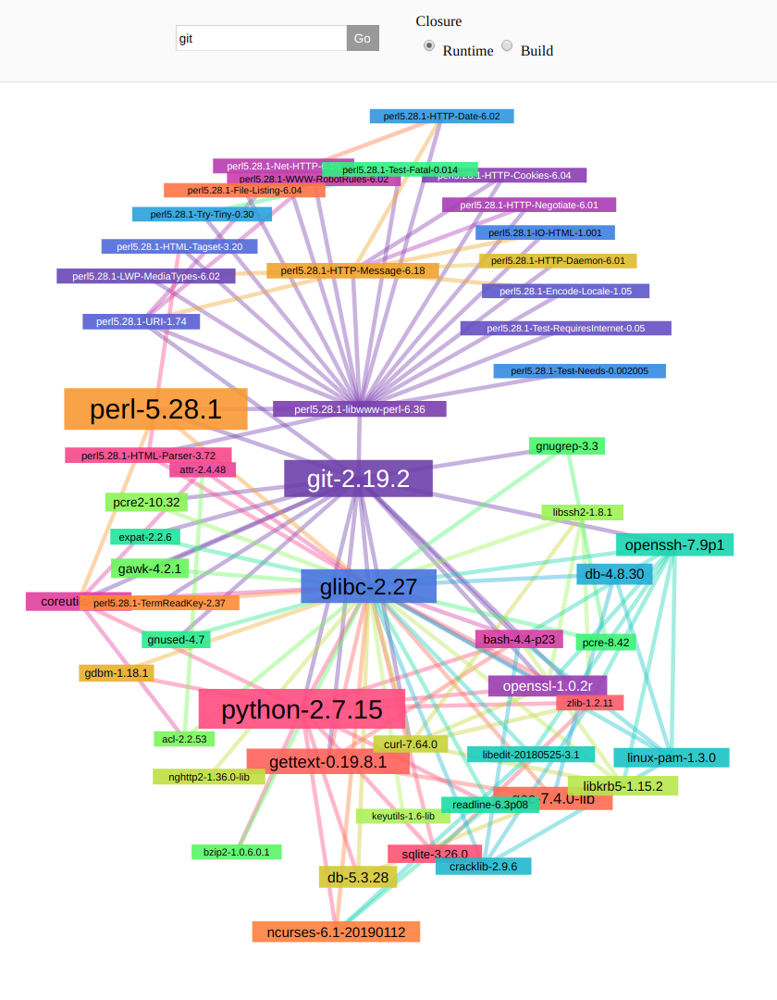

# Grafanix

This tool can visualize build and runtime dependencies of Nix derivations.



## Building

```bash
nix-build --attr grafanix --out-link grafanix
```

If you don't want to wait, grab the latest [release](https://github.com/stolyaroleh/grafanix/releases).

## Running

```bash
./grafanix/bin/grafanix --help # show available options
./grafanix/bin/grafanix        # start Grafanix, use <nixpkgs>
```

After starting Grafanix, open `localhost:3000` in your browser.

## Hacking

I suggest using VSCode with the following plugins:

- ghcide
- HTML CSS Support
- Elm Support

Make sure you run it in a shell with all necessary tooling:

```bash
nix-shell --command "code"
```

### Backend

```bash
cd backend

cabal new-build                                   # Build it
cabal new-repl                                    # Start a REPL
cabal new-run grafanix --static-path="../static"  # Run it, serve static assets from project directory
```

### Frontend

```bash
cd frontend

./scripts/watch.sh # Rebuild on every change
```

### Formatting

```bash
treefmt
```